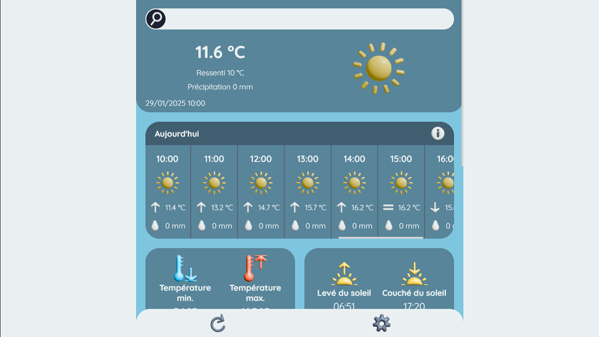

# Weather PWA 🌦️

A modern Progressive Web App that provides accurate and up-to-date weather forecasts using ReactJS and the Open-Meteo API.

All visuals were custom-made in **Blender** and the application is built as a fully functional, installable weather dashboard.



---

## 🚀 Demo

See my [portfolio yohannimation](https://weather.yohannimation.fr)

---

## 🧰 Tech Stack

- ⚛️ **ReactJS** – Front-end framework
- 📡 **[Open-Meteo API](https://open-meteo.com/en/docs)** – Weather data
- 🌍 **[Open-Meteo Geocoding API](https://open-meteo.com/en/docs/geocoding-api)** – Location data
- 📦 **PWA** – Installable progressive web application
- 🎨 **Blender** – Custom 3D visuals and illustrations

---

## 🎯 Project Goal

The goal of this project was to design and develop a complete, usable weather application that works as a PWA and delivers essential weather data to the user, packaged with a custom visual experience. 

This project is developed for personal learning and demonstration purposes.

---

## ✨ Features

- ✅ **Current** weather conditions
- ✅ **Hourly** forecast
- ✅ **Daily** forecast
- ✅ **Weekly** forecast
- ✅ Custom **visuals** and icons built in Blender
- ✅ PWA installable on Chromium-based browsers
- ✅ Weather information based on **geolocation**
- ✅ **Translation** (French 🇫🇷 / English 🇬🇧)

---

## 📲 How to Install the PWA

This app can be installed on Chromium-based browsers only (Chrome, Edge, Brave...).

Click the install icon in your browser’s address bar **OR** open the app settings and click the **"Install"** button if available.

If you want to install this app on another browser, you can add it to the home screen. This is what I do with my Samsung internet browser.

---

## 📦 Installation

```bash
# Clone the repository
git clone https://github.com/yohannimation/weather-pwa.git

# Go to the project directory
cd weather-pwa

# Install dependencies
npm install

# Run the app locally
npm start
```

---

## 🧭 Planned Features

- 🌧️ Add a weather map showing precipitation/cloud movement at user's location
- 🌐 Allow user to select time zone in settings
- 🎨 Improve UI/UX for a more polished experience
- 🛠️ Migrate the app to TypeScript (large task planned for later)

---

## 🙋‍♂️ Author

Created by **Yohann RENAULD**

[Github](https://github.com/yohannimation) - [Portfolio yohannimation](https://yohannimation.fr)